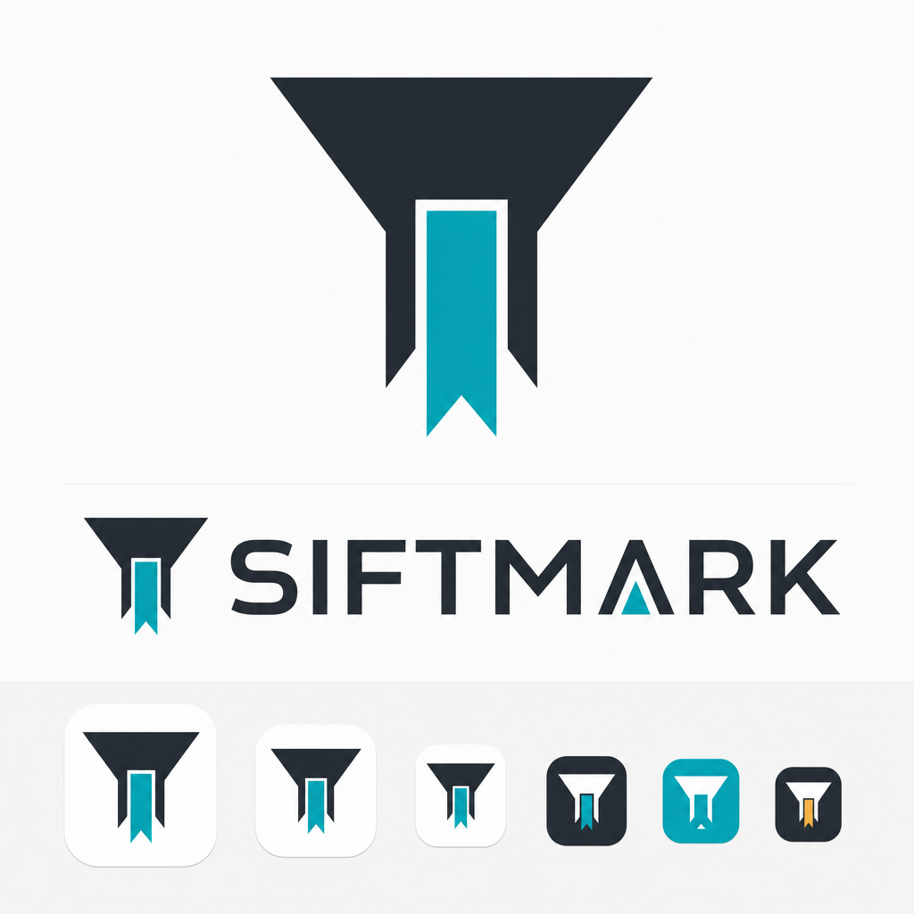
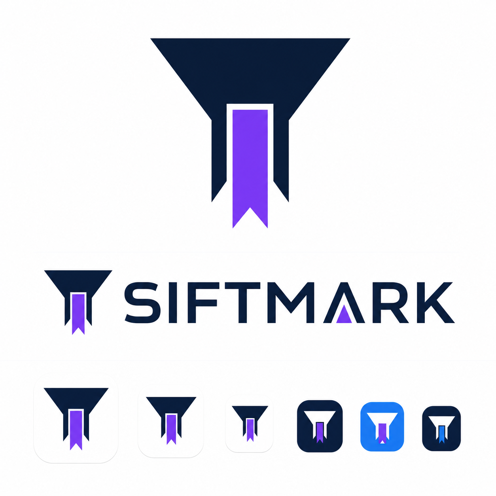
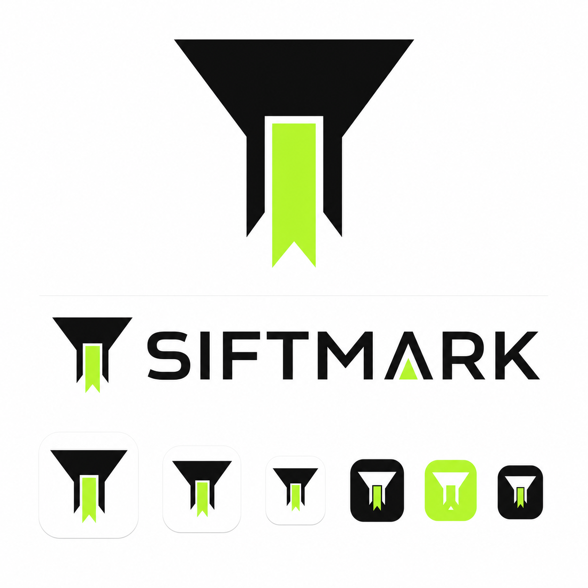

<div align="center">


# Siftmark

[English](README.en.md)

**本地优先的 Chromium AI 书签管理器。** 原生书签始终是唯一事实来源，AI 只负责出方案，本地执行器负责落地。

<sub>// 无账号 · 无服务端 · 无遥测</sub>

<br />


</div>

---

## 它解决什么

浏览器原生书签流程太慢：手动选文件夹、起标题、之后再也找不到。Siftmark 把收藏变成一条 Agent 管线——你照常 `Ctrl+D`，AI 出整理方案，本地执行器落地，你只需要审批或忽略。

- 原生 `Ctrl+D` / 浏览器星标是主入口；`Ctrl+Shift+S` 与右键收藏复用同一条 Agent 管线
- 书签始终先写入 Chromium：安全方案自动归类，风险方案移入待整理箱并弹出网页审批浮层
- **模型只生成结构化方案**，移动、改名、新建目录、重复合并、撤销全部由本地确定性执行器完成
- 可选睡眠回顾：空闲时从已解决结果中提炼弱偏好，只影响未来建议，不直接动书签
- Popup 只显示待处理队列与最近结果；Side Panel 承载收藏 Agent 的持续对话与方案调整

## 截图

> 界面预览：设计阶段配色方案（A / B / C）。

<table>
  <tr>
    <td width="33%" align="center"><sub><b>方案 A</b></sub></td>
    <td width="33%" align="center"><sub><b>方案 B</b></sub></td>
    <td width="33%" align="center"><sub><b>方案 C</b></sub></td>
  </tr>
</table>

## 功能

- 🗂 **管理器** — 虚拟化文件夹树与书签列表、详情编辑、本地/语义搜索、审核、草稿、通知、统计
- 🤖 **收藏 Agent** — 结构化方案 + 本地执行器；风险操作必须经你审批
- 📏 **本地规则** — 按域名、URL、标题、来源文件夹移动、加标签、跳过 AI 或送入待整理箱
- 🧹 **特殊文件夹** — 归档、回收站、待整理箱通过原生书签 ID 绑定；删除绑定文件夹即暂停相关流程
- 💾 **备份恢复** — Siftmark JSON/ZIP、浏览器 Bookmark HTML、MarkAI JSON 导入，含密钥的加密 `.siftmark-backup`；分级重置永不删除原生书签

## 安装

当前版本 `0.1.4`，提供开发者模式构建，不提交 Chrome Web Store 或 Edge Add-ons。

要求 Node.js 22 + pnpm 10：

```powershell
git clone https://github.com/zxbdzh/Siftmark.git
cd Siftmark
corepack enable
pnpm install --frozen-lockfile
pnpm build
```

- **Chrome**：`chrome://extensions` → 启用开发者模式 → 加载已解压的扩展程序 → 选择 `.output/chrome-mv3`
- **Edge**：`edge://extensions` → 启用开发人员模式 → 加载解压缩的扩展 → 选择同一目录

首次打开设置页会进入五步引导，每一步均可跳过；未配置模型时原生书签仍会立即保存。

### 权限说明

生产构建请求：`bookmarks` / `storage` / `tabs` / `scripting` + `<all_urls>` / `contextMenus` / `alarms` / `idle` / `sidePanel`；`notifications` 可选。API Key 以原值保存在 `chrome.storage.local`，模型请求直连你配置的服务商。详见 [权限与隐私](docs/privacy-and-permissions.md)。

## 开发

```powershell
pnpm dev            # 开发
pnpm typecheck      # 类型检查
pnpm lint           # ESLint
pnpm test           # vitest
pnpm test:e2e       # Playwright（本地确定性夹具，无需真实 API Key）
pnpm zip            # 打包发布产物
```

开发约定、测试结构和新增模型预置方法见 [开发指南](docs/development.md) 与 [模型协议](docs/model-protocols.md)。

## 文档

- [用户指南](docs/user-guide.md) · [开发指南](docs/development.md) · [架构说明](docs/architecture.md)
- [收藏 Agent 设计](docs/design/2026-08-11-capture-agent.md) · [模型协议](docs/model-protocols.md)
- [备份与恢复](docs/backup-and-restore.md) · [权限与隐私](docs/privacy-and-permissions.md)
- [性能基线](docs/testing/performance-baseline.md) · [Chrome 人工验收](docs/testing/manual-chrome.md) · [Edge 人工验收](docs/testing/manual-edge.md)

## 许可

本仓库未授予 Siftmark 源码的开源许可证。第三方代码、字体和素材保留各自许可证，见 [THIRD_PARTY_NOTICES.md](THIRD_PARTY_NOTICES.md)。
